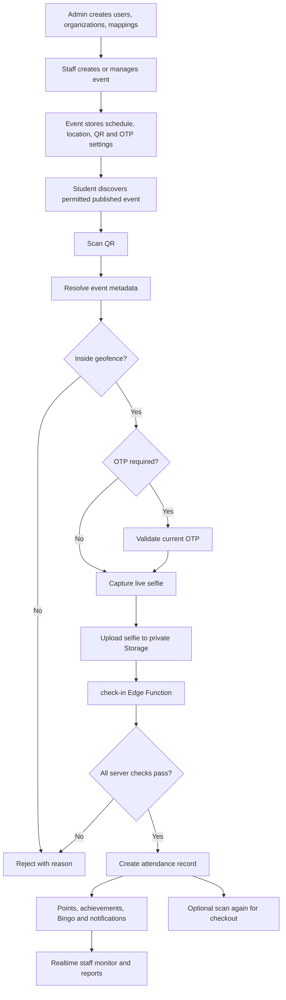
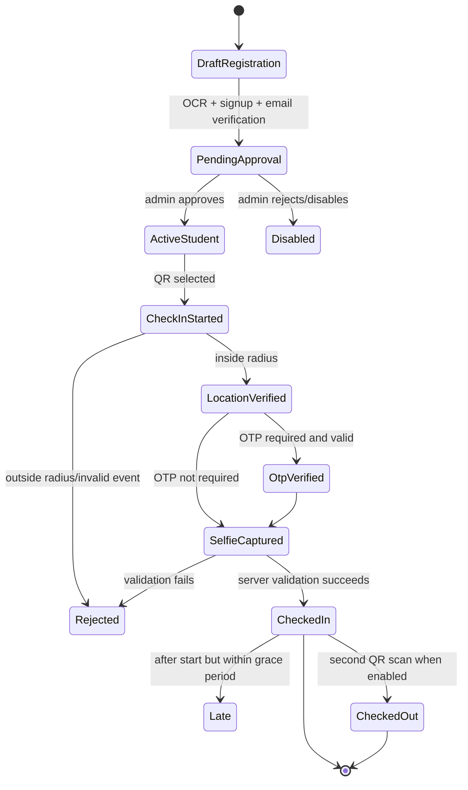
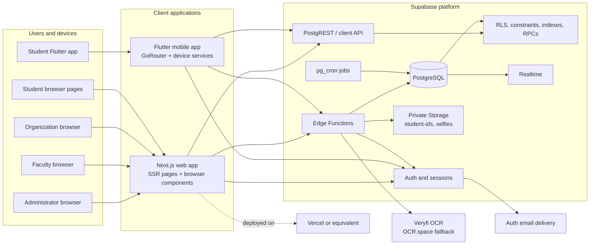
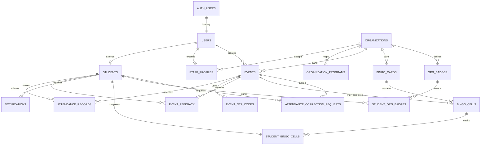
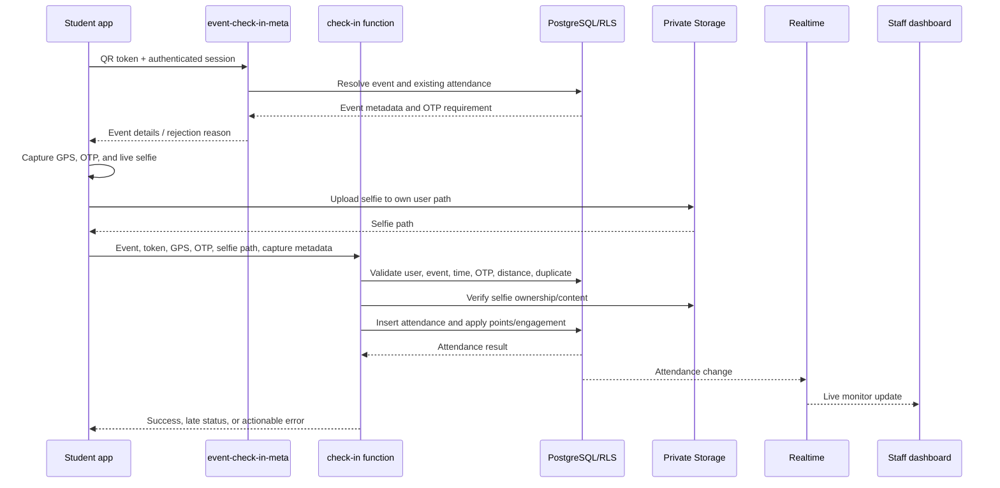

# CheckedIn Software Requirements Specification

**Version:** 1.0  
**Date:** 2026-09-05  
**System:** CheckedIn University Event Attendance and Engagement Platform

## 1. Purpose and Scope

CheckedIn is a university attendance platform for creating events, admitting participants, verifying physical attendance, monitoring participation, and providing engagement features. It consists of a Next.js web application for administrators, faculty, and organization members; a Flutter mobile application for students; and a Supabase backend.

The implemented baseline covered by this specification includes:

- Student registration using student-ID camera capture and OCR-assisted data entry.
- Account verification, approval, authentication, and password recovery.
- Event discovery and QR-based attendance.
- GPS geofencing, optional OTP verification, and live selfie capture.
- Server-side attendance validation, duplicate prevention, checkout, and corrections.
- Live monitoring, reports, analytics, absentee reporting, and exports.
- Reward points, achievements, Bingo cards, organization badges, and notifications.
- Limited offline student browsing and queued attendance synchronization.

## 2. System Context and Actors

### 2.1 Actors

| Actor | Main responsibilities |
| --- | --- |
| Administrator | Manage users, organizations, events, approvals, program mappings, settings, reports, analytics, notifications, Bingo, and system data. |
| Faculty | View permitted events, monitor attendance, review reports, analytics, and absentee information. Faculty are report-focused and do not create events. |
| Organization member | Create and manage events for the assigned organization, display QR codes, generate OTPs, rotate QR tokens, monitor attendance, and manage organization Bingo and badges. |
| Student | Register, authenticate, discover permitted events, check in/out, view history, submit feedback, and track rewards and achievements. |
| Supabase Auth | Maintains authenticated identities and sessions and supports email verification/password operations. |
| OCR providers | Extract student-ID data. Veryfi is primary; OCR.space supports selected fallback extraction. |
| Device services | Provide camera, GPS, network state, and screenshot/screen-recording signals. |

### 2.2 System Boundary

Inside the boundary are the web and mobile clients, Supabase Auth, PostgreSQL, Row Level Security (RLS), private Storage, Realtime, database functions/triggers, Edge Functions, and scheduled jobs. External dependencies are the OCR providers, email delivery through Supabase Auth, web hosting, mobile operating systems, and network/location services.

## 3. Overall System Flow

## 4. Functional Requirements

### 4.1 Identity, access, and account lifecycle

| ID | Requirement | Priority |
| --- | --- | --- |
| FR-01 | The system shall authenticate protected web and mobile operations through Supabase Auth sessions. | Must |
| FR-02 | The system shall assign each account one supported role: `admin`, `faculty`, `org_member`, or `student`. | Must |
| FR-03 | The system shall enforce authorization in both client routing and backend RLS/server functions. | Must |
| FR-04 | An administrator shall create and manage faculty and organization-member accounts and their profiles. | Must |
| FR-05 | A student shall register by capturing a student ID image with the device camera. | Must |
| FR-06 | The system shall use OCR to extract student ID, name, and program and shall allow the student to confirm or edit permitted fields. | Must |
| FR-07 | The system shall validate the student ID format `0XXX-XXXX`, keep the ID immutable after registration, and prevent duplicates. | Must |
| FR-08 | The system shall store new student accounts as pending until an administrator approves them. | Must |
| FR-09 | The student shall verify the supplied email through an authentication verification code before normal use. | Must |
| FR-10 | A student shall recover a password by scanning the student ID, receiving an email code, and setting a new password. | Must |

### 4.2 Organization and event management

| ID | Requirement | Priority |
| --- | --- | --- |
| FR-11 | An administrator shall create and maintain organizations. | Must |
| FR-12 | An administrator shall map normalized student programs to organizations. | Must |
| FR-13 | An administrator or organization member shall create an event with title, description, venue, coordinates, radius, start/end times, and creator. | Must |
| FR-14 | The system shall reject invalid event time ranges and out-of-range geofence radii. | Must |
| FR-15 | Faculty shall have read/report access but shall not create events. | Must |
| FR-16 | Organization members shall be restricted to their assigned organization by backend policy. | Must |
| FR-17 | Staff shall view and manage event status, attendance windows, QR display, OTP settings, and QR rotation. | Must |
| FR-18 | Published global events shall be visible to students; organization events shall be visible only to students whose program is mapped to that organization. | Must |
| FR-19 | The system shall support QR token expiry, manual rotation, configurable automatic rotation, and rotation audit records. | Should |
| FR-20 | The system shall support an optional six-digit attendance OTP with configurable expiry. | Should |

### 4.3 Attendance and verification

| ID | Requirement | Priority |
| --- | --- | --- |
| FR-21 | A student shall start attendance by scanning an event QR code or opening an eligible event. | Must |
| FR-22 | The system shall resolve the QR token to event metadata and report whether OTP is required. | Must |
| FR-23 | The system shall verify the student's device location against the event coordinates using a server-side distance calculation. | Must |
| FR-24 | The system shall require and validate the current OTP when the event requires one. | Should |
| FR-25 | The system shall require a live camera selfie and upload it to private Storage before final check-in. | Must |
| FR-26 | The system shall detect suspected screenshot/screen-recording submissions where supported by the client/device. | Should |
| FR-27 | The check-in service shall validate identity, account status, event status, schedule, QR token, OTP, selfie ownership/content, geofence, and duplicate status server-side. | Must |
| FR-28 | The system shall create at most one attendance record per student and event. | Must |
| FR-29 | The system shall record check-in time, coordinates, distance, selfie path, verification flags, and attendance status. | Must |
| FR-30 | The system shall distinguish normal and late attendance using the configured late grace period. | Must |
| FR-31 | A student shall scan the same event QR to request checkout after a successful check-in. | Should |
| FR-32 | Checkout shall require an existing successful attendance record and shall record checkout time. | Should |
| FR-33 | Authorized staff shall submit and review attendance correction requests. | Should |

### 4.4 Engagement, communication, and operations

| ID | Requirement | Priority |
| --- | --- | --- |
| FR-34 | The system shall award configured reward points for successful normal or late attendance. | Should |
| FR-35 | The system shall update achievements, Bingo cells, streaks, line completion, organization badges, and related points after eligible attendance. | Should |
| FR-36 | Students shall view attendance history, points, achievements, Bingo progress, badges, and notifications. | Should |
| FR-37 | Authorized staff shall monitor attendance changes in near real time. | Must |
| FR-38 | Staff shall generate attendance, absentee, participation, and analytics reports and export supported report formats. | Must |
| FR-39 | Administrators shall broadcast in-app notifications and view audit records. | Should |
| FR-40 | Students shall submit one feedback response per event, subject to event participation and policy. | Should |
| FR-41 | After one successful online login, the mobile app shall cache permitted data and queue eligible offline attendance for later synchronization. | Should |
| FR-42 | Offline attendance shall preserve capture-time validity and may synchronize for up to seven days after the event ends; registration, password recovery, profile edits, and feedback remain online-only. | Should |

## 5. Non-Functional Requirements

| ID | Category | Requirement |
| --- | --- | --- |
| NFR-01 | Security | RLS, role checks, organization scoping, and trusted Edge Functions shall protect records and sensitive workflows. |
| NFR-02 | Privacy | Student ID images and selfies shall be stored in private buckets; students may upload only to their own user-ID path. |
| NFR-03 | Credential protection | Service-role credentials shall remain in server/Edge Function environments and shall never be shipped to clients. |
| NFR-04 | Integrity | Foreign keys, unique constraints, check constraints, duplicate prevention, and server-side validation shall preserve data correctness. |
| NFR-05 | Availability | The mobile client shall provide cached read access and queued attendance during temporary connectivity loss after initial online authentication. |
| NFR-06 | Performance | Attendance monitoring shall use indexed queries and Supabase Realtime so operational users receive timely updates without manual refresh. |
| NFR-07 | Auditability | Sensitive actions such as OTP generation, QR rotation, corrections, and administration shall be auditable. |
| NFR-08 | Configurability | OTP expiry, QR rotation, late grace, session timeout, and default OTP behavior shall be configurable through system settings. |
| NFR-09 | Usability | Student verification shall be progressive and explain the reason and next action for QR, location, OTP, and selfie steps. |
| NFR-10 | Compatibility | The web client shall run in current supported browsers; the mobile client shall run on supported Android and iOS devices with camera and location access. |
| NFR-11 | Maintainability | Database changes shall be delivered as ordered Supabase migrations; client and backend responsibilities shall remain separated by trust boundary. |
| NFR-12 | Deployment | The web application shall be deployable to Vercel or an equivalent Next.js host; Supabase migrations, functions, secrets, and storage policies shall be deployable independently. |
| NFR-13 | Resource limits | Application uploads shall respect configured Storage limits and shall compress/capture images within the supported mobile workflow. |

## 6. System Design

### 6.1 Major design components

1. **Presentation clients:** Next.js routes/components for staff and browser student surfaces; Flutter screens/services for mobile students.
2. **Authentication and session layer:** Supabase Auth, secure web cookies/SSR session handling, mobile session handling, email OTP, and timeout controls.
3. **Application data layer:** Supabase JavaScript/Flutter clients access permitted tables and invoke trusted functions.
4. **Trusted workflow layer:** Edge Functions perform OCR, registration completion, password recovery, event metadata resolution, OTP/QR administration, check-in, and checkout.
5. **Persistence layer:** PostgreSQL tables, constraints, indexes, RLS, functions, triggers, and private Storage buckets.
6. **Event/notification layer:** Supabase Realtime subscriptions and notification records update dashboards and student views.
7. **Scheduled operations:** pg_cron jobs rotate QR codes, generate/expire OTPs, and clean up expired data as configured.

### 6.2 Process model

### 6.3 Access model

The database is the authorization source of truth. Frontend route guards improve user experience but do not replace RLS. The main access rules are:

- Admin: system-wide permitted access.
- Faculty: permitted published event/report access, without event creation.
- Organization member: organization-scoped management based on `staff_profiles.organization_id`.
- Student: own profile/attendance data plus published global content and organization content allowed by program mapping.

## 7. System Architecture

### 7.1 Graphical architecture

### 7.2 Architecture narrative

Clients use public Supabase configuration and authenticated sessions. Normal reads and permitted writes go through the Supabase API and are filtered by RLS. Sensitive workflows use Edge Functions so secrets, service-role access, OCR calls, and validation rules stay server-side. PostgreSQL is the system of record; database constraints and RPCs enforce invariants such as one attendance per event/student and point/achievement updates. Private Storage holds identity and selfie evidence. Realtime publishes relevant changes to monitoring dashboards and notifications. Scheduled jobs perform time-based QR/OTP maintenance.

The architecture addresses security through layered enforcement, availability through mobile caching and queueing, integrity through database constraints and trusted functions, and operational responsiveness through indexes and Realtime.

## 8. Hardware and Software Requirements

### 8.1 Development resources

- Windows, macOS, or Linux development workstation with internet access.
- Node.js 20 or later, npm, and TypeScript toolchain.
- Flutter/Dart compatible with the project SDK constraint `^3.11.4`.
- Android SDK/emulator and/or Xcode/iOS simulator for mobile builds.
- Supabase CLI and Docker-compatible local Supabase environment.
- Git and a modern browser.
- Test devices or emulators with camera, location, network, and notification capabilities.

### 8.2 Runtime resources

- Web hosting for the Next.js application, such as Vercel.
- Supabase project with Auth, PostgreSQL, Storage, Realtime, Edge Functions, and scheduled jobs.
- Android/iOS device with camera and location services for the primary student check-in flow.
- Email delivery configured for Auth verification and password recovery.
- Veryfi credentials; OCR.space may be used by fallback paths.
- Environment values: web Supabase URL/anon key/service-role key, mobile Supabase URL/anon key, and Edge Function OCR secrets.

## 9. System Components and Modules

| Component/module | Functions |
| --- | --- |
| Web authentication and middleware | Login, role routing, SSR sessions, timeout and protected routes. |
| Admin console | Users, students, staff, organizations, mappings, approvals, settings, audit, notifications, analytics. |
| Faculty console | Published events, monitoring, reports, absentees, analytics. |
| Organization console | Organization events, QR/OTP controls, monitoring, Bingo, badges, reports. |
| Student web surfaces | Browser registration/login, event discovery, attendance support, profile, Bingo, notifications, feedback. |
| Flutter onboarding/auth | Terms, ID scan, registration confirmation, password, email verification, login, reset. |
| Flutter student shell | Home, events, event detail, Bingo, profile, notifications, attendance history. |
| Flutter attendance services | QR scan, metadata resolution, location, OTP, selfie, upload, check-in/out, offline queue. |
| OCR and registration functions | OCR extraction, fallback extraction, trusted profile creation, ID image storage. |
| Attendance functions | Metadata, check-in, checkout, geofence, OTP, selfie, duplicate, late/offline validation. |
| Event security functions | OTP generation, QR rotation, expiry and audit behavior. |
| Engagement functions/RPCs | Points, achievements, Bingo cells, badges, and notifications. |
| Reporting/export module | Attendance and absentee queries, analytics, PDF/XLSX exports, authorized selfie access. |
| Database and security | Tables, relationships, RLS, constraints, indexes, triggers, RPCs, storage policies. |

## 10. Database Structure

### 10.1 Entity relationship model

### 10.2 Principal tables and relationships

| Table/domain | Stored information and key relationships |
| --- | --- |
| `users` | Auth-linked identity, role, account status, and common account metadata. |
| `students` | Student ID, name, program, section, year/profile data, organization linkage, OCR data, and reward points; primary key references `users`. |
| `staff_profiles` | Faculty/org-member name, department, and organization membership; primary key references `users`. |
| `organizations` | Organization name, description, creator, and timestamps. |
| `organization_programs` | Normalized program-to-organization mapping used for visibility. |
| `events` | Event details, venue coordinates, radius, schedule, status, QR token/expiry, OTP flag, creator, and optional organization. |
| `attendance_records` | One row per student/event with check-in time, coordinates, distance, selfie path, status, OTP/fraud flags, and checkout fields added by later migrations. |
| `event_otp_codes` / `qr_rotation_audit` | Short-lived OTPs and QR rotation history. |
| `notifications` | User-targeted in-app notifications and read state. |
| `event_feedback` | One student rating/comment per event. |
| `attendance_correction_requests` | Correction reason, approval status, reviewer, and related attendance/event/student. |
| `badge_definitions` / `student_achievements` | System achievement definitions and student awards. |
| `bingo_cards` / `bingo_cells` | Organization-scoped cards and up to nine event-linked positions. |
| `student_bingo_cells` | Student completion of a cell, optionally linked to attendance. |
| `org_badges` / `student_org_badges` | Organization-defined badges and student awards. |
| `audit_logs` / `system_settings` | Administrative action history and operational configuration. |
| Storage buckets | Private `student-ids` and `selfies` evidence, plus profile assets where configured. |

### 10.3 Database rules

- Student IDs are unique and constrained to `0XXX-XXXX`.
- Event end time must be after start time; radius is positive and bounded.
- Attendance is unique on `(event_id, student_id)`.
- Bingo cell positions are unique within a card; active-card uniqueness is intended per organization.
- RLS policies enforce role, ownership, organization, and program visibility.
- Haversine distance, point increment, achievement awarding, and Bingo application are implemented as trusted database functions/RPCs or trusted Edge Function operations.

## 11. User Interface Design

### 11.1 Web interface

The web application uses role-specific dashboard navigation. Common surfaces include Dashboard, Events, Live Monitor, Reports, Analytics, Notifications, and Settings. Admin navigation additionally includes users/students, organizations, program alignment, approvals, Bingo, and system administration. Organization navigation adds event controls, Bingo, and badges. Faculty navigation omits creation and management actions.

Primary web interaction patterns are server-rendered protected pages, client-side forms for mutations, calendar/event views, QR display, OTP controls, live attendance tables, map/location selection, report filters, charts, and PDF/XLSX export actions.

### 11.2 Mobile interface

The Flutter app uses a routed onboarding/auth flow and a student shell containing Home, Events, Bingo, Profile, and Notifications. Attendance is deliberately sequential: QR scan, event resolution, location permission/check, OTP when required, selfie capture, submission, and explicit success/failure. Offline state is shown through cached data and pending synchronization status.

### 11.3 Accessibility and feedback expectations

The UI shall explain why location, OTP, and selfie evidence are required; show the current step; prevent submission while validation is pending; display actionable errors; and provide a clear attendance result. Camera and location permission failures shall identify the missing permission and recovery action.

## 12. System Communication and Interaction

### 12.1 Attendance sequence

### 12.2 Other communication paths

- Web/mobile clients call Supabase Auth for sessions and email verification/password operations.
- Clients call Edge Functions over HTTPS for trusted workflows.
- Edge Functions call PostgreSQL and private Storage using controlled server-side credentials.
- The OCR function calls Veryfi over HTTPS and may use OCR.space fallback extraction.
- Realtime uses database change publications/subscriptions for dashboards and notification updates.
- pg_cron executes scheduled database/function work for QR and OTP maintenance.
- Mobile device APIs provide camera images, GPS coordinates, connectivity changes, and screenshot signals.

## 13. Deployment and Operations

1. Apply ordered migrations to the target Supabase project.
2. Configure Auth redirect URLs, email delivery, Storage buckets/policies, Realtime publications, and scheduled jobs.
3. Set server-only OCR and service-role secrets in Supabase/hosting environments.
4. Deploy Edge Functions, including the registration function with its required JWT configuration.
5. Deploy the Next.js web app with public Supabase variables and protected server variables.
6. Build and distribute the Flutter app with production Supabase configuration and platform permissions.
7. Monitor audit logs, Edge Function errors, Realtime behavior, failed syncs, and scheduled QR/OTP jobs.

## 14. Assumptions, Constraints, and Known Repository Inconsistencies

- Supabase is the authoritative backend and PostgreSQL is the authoritative data store.
- A student must have a valid approved account and network access for registration, verification, reset, profile edits, and feedback.
- Offline attendance is best-effort and is accepted only when capture-time and synchronization rules pass server validation.
- Current repository history contains early duplicate migrations and some legacy schema definitions. A production deployment must verify the effective applied migration history before applying changes.
- Event approval exists in older migrations/UI, but current event creation and visibility paths primarily use `published` events and organization scoping. Product owners should confirm whether approval is required before treating it as a mandatory current workflow.
- Bingo migrations contain both legacy `is_active` usage and later `status` usage. The intended current lifecycle is `draft`, `active`, and `archived`; schema, policies, and clients should be reconciled before further feature work.
- Student organization visibility depends on program mappings; there is no assumption that every student is automatically assigned to an organization.
- Hosted deployment state, including whether all recent migrations and cron jobs are deployed, must be verified independently of repository files.

## 15. Traceability and Source Evidence

The specification is based on the repository implementation and design material, especially:

- [README.md](README.md) for scope, roles, setup, and deployment prerequisites.
- [System Overview.md](System%20Overview.md) for end-to-end flows, security, UI surfaces, and operations.
- [designprinciples/CheckedIn_UX_Design_Specification.md](designprinciples/CheckedIn_UX_Design_Specification.md) for interaction and role priorities.
- `apps/web/src` for web routes, dashboards, reports, and Supabase access patterns.
- `apps/mobile/lib` for Flutter routing, attendance, offline, camera, GPS, and profile services.
- `backend/supabase/migrations` for schema, constraints, RLS, functions, storage, Realtime, and scheduled operations.
- `backend/supabase/functions` for trusted OCR, registration, attendance, checkout, OTP, QR, and password workflows.