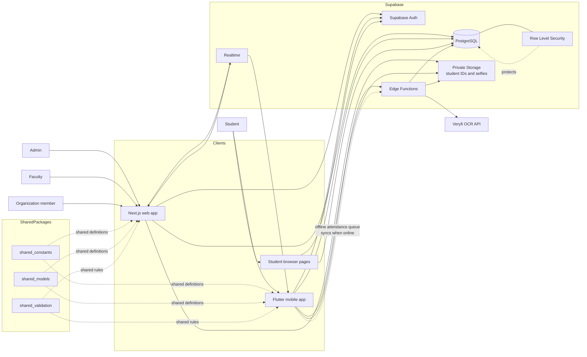

# CheckedIn Architecture

## Main responsibilities

- **Web app:** dashboards and management tools for administrators, faculty, and organization members.
- **Mobile app:** student registration, event discovery, QR check-in, GPS and selfie capture, attendance history, and offline attendance capture.
- **Supabase:** authentication, PostgreSQL data, row-level authorization, private file storage, realtime updates, and trusted Edge Function workflows.
- **Edge Functions:** server-side check-in and offline attendance submission, ID scanning and registration, student login/reset helpers, and staff QR/OTP operations.
- **Veryfi:** OCR provider called by the student ID scanning Edge Function.
- **Shared packages:** common constants, models, and validation used across the applications.
